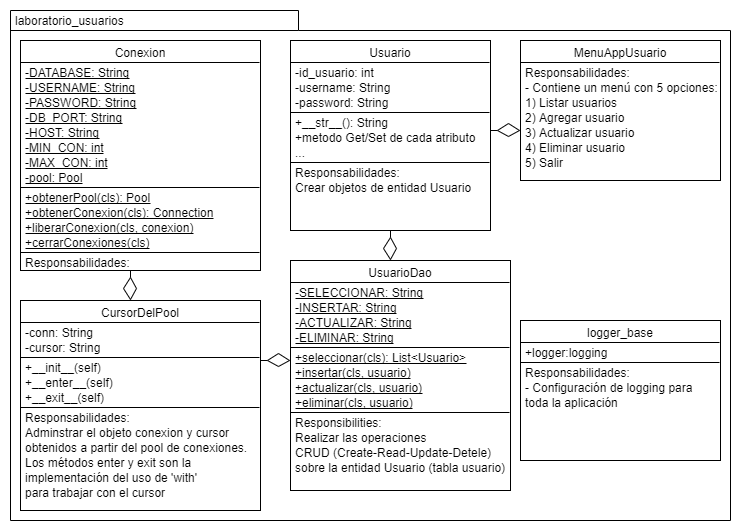

# <h1 align=center> **Usuarios_DB** </h1>

<p align="center">

</p>


# Autor Diego Maneyro

+ [linkedin](https://www.linkedin.com/in/diego-maneyro/)

+ [E-mail](diegomaneyro@gmail.com)

# Base de Datos de Usuarios en PostgreSQL con Python

Este proyecto consiste en la creación de una base de datos de usuarios utilizando Python y PostgreSQL, para administrar datos de usuarios.

# Estructura de Proyecto

<p align="center">

</p>

## Deployment

Clonar este proyecto

```bash
  git clone https://github.com/diegomaneyro/Usuarios_DB.git
```

Instalar librerias

```bash
  pip install -r > requirements.txt
```

Ejecutar App

```bash
  python.exe menu_app_usuario.py 
```


## Uso de la App
* Menu Principal:
<p align="center">

</p>


## App Usuarios:
### Listar usuarios  

| Description | Type     | Parametro                |
| :-------- | :------- | :----------------------- |
| `Opcion 1` | `SELECT` | **None** |


### Agregar usuario  

| Description | Type     | Parametro                            |
| :-------- | :------- | :----------------------------------- |
| `Opcion 2` | `INSERT` | Username, password                  |


### Modificar usuario  

| Description | Type     | Parametro                       |
| :-------- | :------- | :-------------------------------|
| `Opcion 3` | `UPDATE` | id_usuario, Username, password |

### Eliminar usuario  

| Description | Type     | Parametro                |
| :-------- | :------- | :------------------------- |
| `Opcion 4` | `DELETE` | id_usuario |

### Salir

| Description | Type     | Parametro                |
| :-------- | :------- | :------------------------- |
| `Opcion 5` | `Exit` | **None**  |


## License

[MIT](https://choosealicense.com/licenses/mit/)
